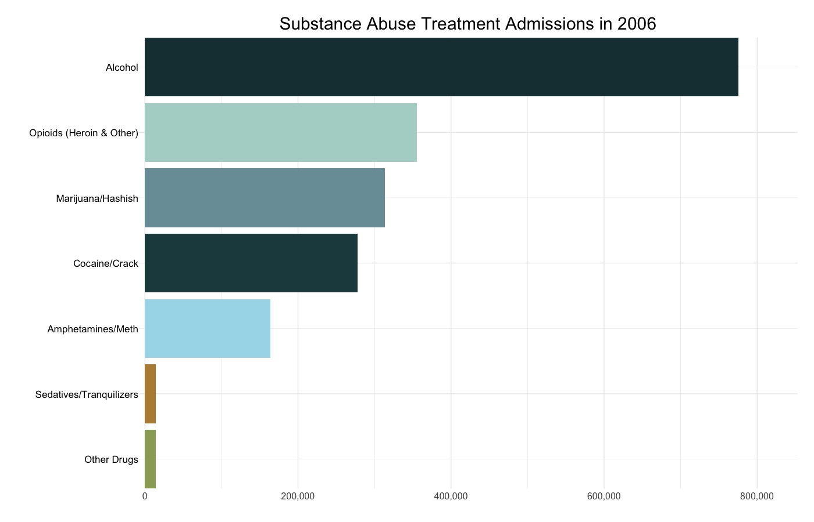

```{r setup, echo = FALSE, include = FALSE}
# Libraries 
library(tidyverse)
library(gganimate)
library(tidytext)
library(scales)
```

```{r, echo = FALSE}
teds = load("../data/tedsa_puf_2006_2023.rdata")
```

```{r, echo = FALSE}
teds_data <- TEDSA_PUF_2006_2023 %>%
  mutate(
    SUB1_group = case_when(
      SUB1 %in% c(2) ~ "Alcohol",
      SUB1 %in% c(3) ~ "Cocaine/Crack",
      SUB1 %in% c(4) ~ "Marijuana/Hashish",
      SUB1 %in% c(5, 6, 7) ~ "Opioids (Heroin & Other)",
      SUB1 %in% c(10, 11, 12) ~ "Amphetamines/Meth",
      SUB1 %in% c(13, 14, 15, 16) ~ "Sedatives/Tranquilizers",
      SUB1 %in% c(8, 9, 17, 18, 19) ~ "Other Drugs",
      TRUE ~ "Missing"
    ))
```


```{r, echo = FALSE, warning = FALSE, message = FALSE}
teds_counts <- teds_data %>%
  group_by(ADMYR, SUB1_group) %>%   # ADMYR = year
  summarize(n = n())
```

```{r, echo = FALSE}
teds_counts <- teds_counts %>%
  mutate(SUB1_group = factor(
    SUB1_group,
    levels = c(
      "Alcohol",
      "Cocaine/Crack",
      "Marijuana/Hashish",
      "Opioids (Heroin & Other)",
      "Amphetamines/Meth",
      "Sedatives/Tranquilizers",
      "Other Drugs"
    )
  ))
```

```{r, echo = FALSE}
# Prepare ranked data per year
teds_counts_ranked <- teds_counts %>%
  filter(!is.na(SUB1_group)) %>%
  group_by(ADMYR) %>%
  arrange(ADMYR, -n) %>%
  mutate(rank = row_number(),
         Label = scales::comma(n)) %>%  # formatted value for labels
  ungroup()
```


```{r, echo = FALSE}
# Custom theme colors from PowerPoint
theme_colors <- c(
  "Alcohol" = "#183c40",
  "Cocaine/Crack" = "#20494d",
  "Marijuana/Hashish" = "#799da7",
  "Opioids (Heroin & Other)" = "#b0d5cd",
  "Amphetamines/Meth" = "#a6daea",
  "Sedatives/Tranquilizers" = "#b78d43",
  "Other Drugs" = "#9aa864"
)
```

```{r, message = FALSE, warning = FALSE, include = FALSE}
# Bar chart race with drug labels right-aligned to the axis
p <- teds_counts_ranked %>%
  ggplot(aes(rank, group = SUB1_group, fill = SUB1_group)) +
  geom_tile(aes(y = n / 2, height = n, width = 0.9), color = NA) +
  geom_text(aes(y = 0, label = SUB1_group), 
            hjust = 1, size = 6, color = "black",
            nudge_y = -0.01 * max(teds_counts_ranked$n)) +
  coord_flip(clip = "off", expand = FALSE) +
  scale_x_reverse() +
  scale_fill_manual(values = theme_colors) +
  scale_y_continuous(labels = scales::comma) +
  transition_states(ADMYR, transition_length = 2, state_length = 2, wrap = FALSE) +
  ease_aes('cubic-in-out') +
  labs(
    title = "Substance Abuse Treatment Admissions in {closest_state}",
    x = NULL,
    y = NULL
  ) +
  theme_minimal(base_size = 16) +
  theme(
    plot.title = element_text(size = 30, face = "bold", hjust = 0.5),
    legend.position = "none",
    plot.margin = margin(1, 1, 1, 8, unit = "cm"),
    axis.text.y = element_blank(),
    axis.text.x = element_text(size = 16)
  )
```

```{r, echo = FALSE}
# Animate and save as GIF
anim <- animate(p, width = 1400, height = 900, fps = 20, duration = 15, end_pause = 50)
anim_save("../figures/treatment-over-time.gif", animation = anim)
```

```{r, echo=FALSE, out.width="100%"}

```


**Figure 5. Substance Abuse Treatment Admissions by Drug Type over Time**

The bar chart race shows trends in substance abuse treatment admissions from 2006 to 2023. Alcohol consistently remains one of the largest contributors to admissions over time. There is a steady increase in admissions related to opioid abuse through the late 2010s, the peak of the opioid epidemic. Admissions for opioid addiction even surpass those related to alcohol abuse in the mid-2010s. Large decreases and gaps in admissions are evident during the COVID-19 pandemic (2020–2021), likely reflecting disruptions in treatment access and data collection. 

Data on treatment episode admissions comes from the Treatment Episode Data Set Admissions (TEDS-A) 2023 (Substance Abuse and Mental Health Services Administration, 2025). The full codebook is available at [SAMHSA](https://www.samhsa.gov/data/). 


